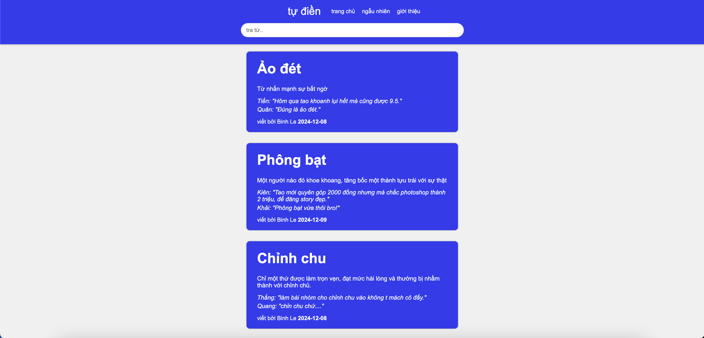

# Vietnamese Urban Dictionary - Tự Điền

Up and coming full-stack application providing up-to-date, accurate definitions and context of Vietnamese slang, to reconnect and strengthen cultural ties

Built using React for the frontend, Express.js for the backend, and PostgreSQL for the database. This project allows users to search, view, and navigate through various Vietnamese slang words along with their definitions and examples.

To do list:

- Leverage web-scraping and machine learning methods to automate word retrieval of various social media platforms
- Update UI/UX
- Add language toggle mode

## Tech Stack

- **Frontend**: React.js, React Router, Tailwind CSS
- **Backend**: Node.js, Express.js
- **Database**: PostgreSQL
- **Other**: Sequelize ORM
